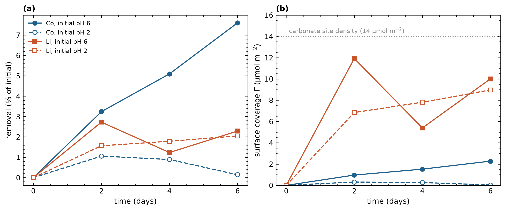
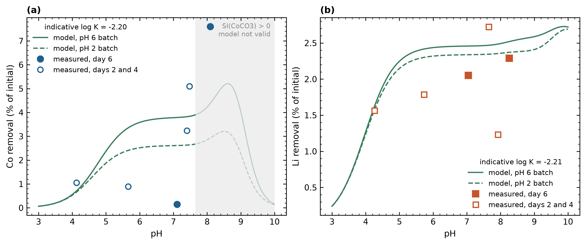
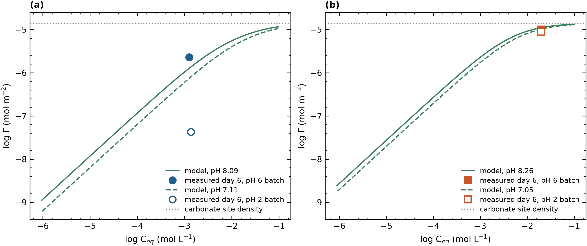
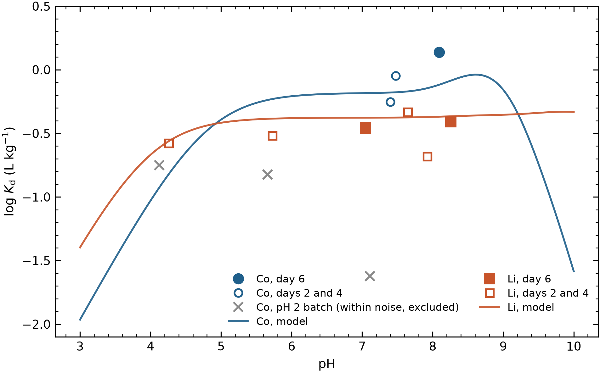
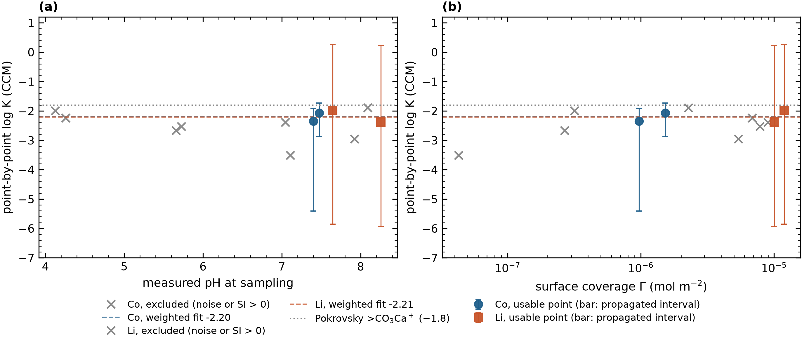
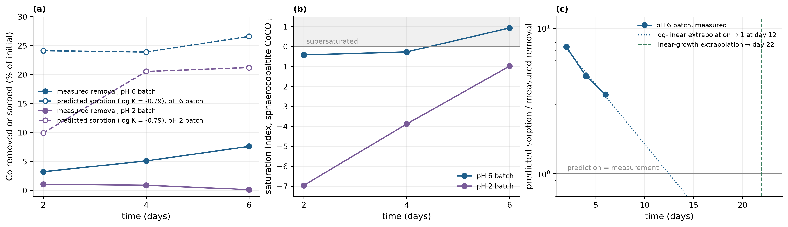
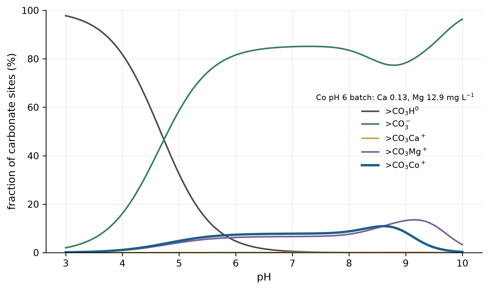

# Surface complexation of lithium and cobalt on dolomite in a sodium chloride brine: a carbonate-site model, capacity constraints, and the separation of sorption from mineralization

**Marwa Elshebli**¹, Javier Vilcáez¹, James Smay²

¹ Boone Pickens School of Geology, Oklahoma State University, Stillwater, OK 74078, USA
² School of Materials, Mechatronics & Manufacturing Engineering, Oklahoma State University, Tulsa, OK 74106, USA

*Draft prepared from the single-ion batch data and the model workflow in the accompanying notebook (`LogK_LiCo_dolomite_carbonate_site_STEPWISE.ipynb`). All numbers in the Results were produced by that notebook; nothing is read from external files.*

---

## Abstract

Dolomite has been shown to recover Li⁺ and Co²⁺ from petroleum produced water, with Li⁺ removal governed mainly by sorption and Co²⁺ removal by coupled sorption and carbonate mineralization (Elshebli et al., 2025). Here the single-ion batch data (dolomite 60 g L⁻¹, 40 g L⁻¹ NaCl, 25 °C, six days) are interpreted with the three-site constant capacitance surface complexation model of Pokrovsky et al. (1999), in which metal cations bind the carbonate site, >CO₃H⁰ + Meᶻ⁺ ⇌ >CO₃Me⁽ᶻ⁻¹⁾⁺ + H⁺. A capacity test applied before any fitting shows that the high-recovery runs reported previously (≈70 mg L⁻¹ Co removed on 0.84 m² g⁻¹ dolomite) correspond to 1.7 to 2.4 times the crystallographic carbonate-site density and therefore cannot be adsorption, consistent with the zabuyelite and sphaerocobaltite detected by XRD. The present low-uptake data set lies inside the monolayer bound (Co 16 %, Li 72 % of carbonate sites), but the cobalt "pH 6" equilibrium point is supersaturated with sphaerocobaltite (SI = +0.93). Aqueous speciation at the measured equilibrium pH (7.05 to 8.26, not the nominal 2 and 6) shows 67 to 69 % of dissolved cobalt as free Co²⁺ and 27 % as CoCl⁺, and 90 % of lithium as free Li⁺. Neither constant proves determinable, and the two fail for different reasons, which is itself the result. For lithium the point-by-point constant is flat in pH (slope +0.02 per pH unit over five usable points spanning pH 4.3 to 8.3, internal spread 0.21), but lithium was dosed above the surface's capacity: the carbonate-site inventory can hold at most 3.2 % of the 20 mmol L⁻¹ present and the measured 2.3 % removal already fills 71 % of the surface, so the mass-action inversion is insensitive and the interval propagated from ±3 % analytical precision runs from −5.9 to +0.8. No central value is reported for lithium. Cobalt sits comfortably inside the monolayer bound (removal is 16 % of its site ceiling of 46.7 %), but its two usable points are both pre-equilibrium (day 2 and day 4 of the pH 6 batch); every day-6 point is excluded, one for sphaerocobaltite supersaturation (SI = +0.93) and three for being within analytical noise. The resulting apparent log K = −2.18 ± 1.18 is a kinetic snapshot rather than an equilibrium constant, and the two usable points span only 0.08 pH units, too narrow for the flat-line diagnostic. The constant taken from the aqueous–surface analogy of Van Cappellen et al. (1993) and Pokrovsky and Schott (2002), log K(>CO₃Co⁺) = −0.79, over-predicts the observed cobalt uptake by a factor of 3.5 to 7.4, so precipitation is not required to explain the removal measured in this low-uptake data set; the sorption prediction itself is too high. Ca/Mg competition and precipitation are both ruled out as causes by the data, leaving the borrowed constant, a reactive area of 13 to 29 % of BET (a three- to eight-fold reduction, against the 1.4-fold reduction Belova et al. explored), or incomplete equilibration. The time trend discriminates among these: the predicted sorption is flat to 11 % of its mean across the six days while the measured removal grows 2.3-fold, so the ratio closes monotonically from 7.4 to 3.5. A wrong constant or a reduced reactive area are time-invariant scalings and would hold the ratio flat; a closing ratio is the signature of a system still approaching equilibrium. Crude extrapolation places the meeting point at two to three weeks, so the six-day experiment may simply have stopped too early, and a single month-long batch sampled weekly would settle it. Sorption cannot account for more than 41 % of the cobalt removed in the best previously reported run even if every carbonate site were occupied, which quantifies the coupled sorption–mineralization mechanism proposed earlier. The experimental design required for a genuinely transferable constant is specified.

**Keywords:** dolomite; surface complexation; constant capacitance model; lithium; cobalt; produced water; sphaerocobaltite; zabuyelite

---

## 1. Introduction

Lithium and cobalt are strategic metals whose recovery from saline produced water using low-cost carbonate minerals has attracted interest (Elshebli et al., 2025). Interpreting such uptake quantitatively requires a surface complexation model (SCM) that accounts for aqueous speciation, competition for surface sites, and the electrostatics of the mineral–water interface (Dzombak & Morel, 1990; Stumm & Morgan, 1996). For carbonate minerals the appropriate framework is the hydration-site model developed for calcite by Van Cappellen et al. (1993) and extended to magnesite and dolomite by Pokrovsky et al. (1999a, 1999b), in which three primary surface groups, >CO₃H⁰, >CaOH⁰ and >MgOH⁰, undergo protonation, deprotonation and complexation with the lattice ions and dissolved carbonate. In this model metal cations adsorb by forming >CO₃Me complexes on the deprotonated carbonate site, whereas anions and ligands bind the metal hydroxyl sites (Pokrovsky et al., 1999a). Belova et al. (2014) applied the same approach to nickel adsorption on calcite and chalk, determining the >CO₃Ni⁺ constant with FITEQL (Herbelin & Westall, 1999) and demonstrating the importance of preventing surface precipitation during the experiment.

An intrinsic stability constant describes a monolayer reaction at an interface. Where a large share of the metal has left solution as a discrete carbonate phase, a constant fitted to that removal is not an interfacial property but a lumped parameter that absorbs the solubility product, the carbonate supply from dolomite dissolution and the nucleation behaviour of the precipitate. The earlier study established that cobalt removal by dolomite is coupled sorption and mineralization and left the quantitative split as an open question (Elshebli et al., 2025). The purpose of this work is therefore twofold: to specify the carbonate-site SCM for lithium and cobalt on dolomite in brine, with every reaction, equation and parameter stated and sourced, and to determine what the existing data can and cannot constrain, using a capacity test and a saturation test before any fitting, and using the model in prediction mode to quantify the sorption–mineralization split.

---

## 2. Materials and methods

### 2.1 Dolomite and batch experiments

Dolomite from the Arbuckle Group (98 % dolomite by XRD) was ground and sieved; the single-ion batches used 6 g of dolomite per 100 mL of solution (60 g L⁻¹) in 40 g L⁻¹ NaCl at 25 °C, shaken at 150 rpm, with a nominal initial pH of 2 or 6 (Elshebli et al., 2025). Lithium (138.4 mg L⁻¹ from LiCl) or cobalt (80.5 mg L⁻¹ from CoCl₂·6H₂O) was added as the only trace metal. Aliquots were taken at 2, 4 and 6 days and analysed by ICP-OES for Li, Co, Ca and Mg; pH was recorded at each sampling. The specific surface area of the powder used here is 0.76 m² g⁻¹ (mean particle diameter 2.8 µm, density 2850 kg m⁻³), giving a surface concentration

S = 60 g L⁻¹ × 0.76 m² g⁻¹ = 45.6 m² L⁻¹.   (1)

The value of 0.046 to 0.049 m² L⁻¹ quoted in the methods of Elshebli et al. (2025) is inconsistent with 0.84 m² g⁻¹ × 60 g L⁻¹ ≈ 50 m² L⁻¹ by a factor of 10³ and is most likely m² mL⁻¹; every surface normalization in an SCM divides by this quantity, so the corrected value is used throughout.

### 2.2 Experimental data

Table 1 gives the embedded data set. The measured pH at day 6 (7.05 to 8.26) differs from the nominal initial pH because dolomite dissolution buffers the suspension; the measured value is the one that enters the model.

**Table 1.** Single-ion batch data (dolomite 60 g L⁻¹, 40 g L⁻¹ NaCl, 25 °C).

| Metal | Batch | Day | Ca (mg L⁻¹) | Mg (mg L⁻¹) | Metal (mg L⁻¹) | pH (measured) | Removal (%) |
|---|---|---|---|---|---|---|---|
| Co | pH 6 | 0 | 0.10 | 0.10 | 80.513 | 6.32 | 0 |
| Co | pH 6 | 2 | 0.10 | 0.10 | 77.905 | 7.40 | 3.24 |
| Co | pH 6 | 4 | 0.10 | 8.14 | 76.411 | 7.48 | 5.09 |
| Co | pH 6 | 6 | 0.13 | 12.94 | 74.393 | 8.09 | 7.60 |
| Co | pH 2 | 0 | 0.10 | 0.10 | 80.513 | 2.35 | 0 |
| Co | pH 2 | 2 | 57.48 | 17.46 | 79.661 | 4.12 | 1.06 |
| Co | pH 2 | 4 | 24.18 | 45.59 | 79.795 | 5.66 | 0.89 |
| Co | pH 2 | 6 | 21.66 | 51.38 | 80.398 | 7.11 | 0.14 |
| Li | pH 6 | 0 | 0.66 | 0.10 | 138.430 | 6.42 | 0 |
| Li | pH 6 | 2 | 37.63 | 0.10 | 134.657 | 7.65 | 2.73 |
| Li | pH 6 | 4 | 54.82 | 0.10 | 136.722 | 7.92 | 1.23 |
| Li | pH 6 | 6 | 49.89 | 0.87 | 135.262 | 8.26 | 2.29 |
| Li | pH 2 | 0 | 0.66 | 0.10 | 138.430 | 2.25 | 0 |
| Li | pH 2 | 2 | 39.19 | 0.10 | 136.263 | 4.26 | 1.57 |
| Li | pH 2 | 4 | 79.45 | 21.32 | 135.956 | 5.73 | 1.79 |
| Li | pH 2 | 6 | 87.74 | 20.55 | 135.592 | 7.05 | 2.05 |

### 2.3 Aqueous speciation

Free-ion activities were computed at each data point from the measured pH, the measured total Ca and Mg, the NaCl medium and the measured total metal, at fixed atmospheric pCO₂ = 10⁻³·⁵ atm (open system, as in Pokrovsky et al., 1999a). Activity coefficients follow the Davies equation (Davies, 1962), valid to I ≈ 0.7 M,

log γᵢ = −A zᵢ² [ √I / (1 + √I) − 0.3 I ],  A = 0.509 at 25 °C.   (2)

The carbonate system is fixed by pH and pCO₂:

CO₂(g) ⇌ CO₂(aq), log K_H = −1.469;  CO₂(aq) + H₂O ⇌ HCO₃⁻ + H⁺, log K = −6.345;  CO₃²⁻ + H⁺ ⇌ HCO₃⁻, log K = 10.329   (3)

(Wolery, 1992). Aqueous complexes were written as formation reactions from the free ions with the constants in Table 2 (Smith & Martell, 2004; Wolery, 1992). For each cation X with analytical total T_X the mass balance

T_X = [X] + Σᵢ [Xᵢ-complex]   (4)

was solved by fixed-point iteration together with the chloride balance and the ionic strength. Saturation indices were computed as SI = log(IAP/K_sp) with log K_sp = −8.48 for calcite (Plummer & Busenberg, 1982), −17.09 for ordered dolomite (Parkhurst & Appelo, 2013), −9.98 for sphaerocobaltite CoCO₃ (Smith & Martell, 2004) and ≈ −2.5 for zabuyelite Li₂CO₃.

**Table 2.** Aqueous complexation reactions (formation from free ions, 25 °C, I = 0).

| Reaction | log β | Reaction | log β |
|---|---|---|---|
| Ca²⁺ + Cl⁻ ⇌ CaCl⁺ | −0.70 | Co²⁺ + Cl⁻ ⇌ CoCl⁺ | 0.30 |
| Ca²⁺ + CO₃²⁻ ⇌ CaCO₃⁰ | 3.22 | Co²⁺ + 2Cl⁻ ⇌ CoCl₂⁰ | −0.20 |
| Ca²⁺ + H⁺ + CO₃²⁻ ⇌ CaHCO₃⁺ | 11.43 | Co²⁺ + CO₃²⁻ ⇌ CoCO₃⁰ | 4.23 |
| Ca²⁺ + H₂O ⇌ CaOH⁺ + H⁺ | −12.70 | Co²⁺ + H⁺ + CO₃²⁻ ⇌ CoHCO₃⁺ | 12.20 |
| Mg²⁺ + Cl⁻ ⇌ MgCl⁺ | −0.14 | Co²⁺ + H₂O ⇌ CoOH⁺ + H⁺ | −9.65 |
| Mg²⁺ + CO₃²⁻ ⇌ MgCO₃⁰ | 2.98 | Co²⁺ + 2H₂O ⇌ Co(OH)₂⁰ + 2H⁺ | −18.80 |
| Mg²⁺ + H⁺ + CO₃²⁻ ⇌ MgHCO₃⁺ | 11.40 | Li⁺ + Cl⁻ ⇌ LiCl⁰ | −0.50 |
| Mg²⁺ + H₂O ⇌ MgOH⁺ + H⁺ | −11.79 | Li⁺ + H₂O ⇌ LiOH⁰ + H⁺ | −13.64 |
| Na⁺ + Cl⁻ ⇌ NaCl⁰ | −0.78 | Li⁺ + CO₃²⁻ ⇌ LiCO₃⁻ | 0.90 |
| Na⁺ + CO₃²⁻ ⇌ NaCO₃⁻ | 1.27 | | |
| Na⁺ + H⁺ + CO₃²⁻ ⇌ NaHCO₃⁰ | 10.48 | | |
| Na⁺ + H₂O ⇌ NaOH⁰ + H⁺ | −14.18 | | |

### 2.4 Surface complexation model

The dolomite surface is described by three primary hydration sites in the ratio 1 : 1 : 2, with site densities of 7 µmol m⁻² for >CaOH⁰, 7 µmol m⁻² for >MgOH⁰ and 14 µmol m⁻² for >CO₃H⁰ (Pokrovsky et al., 1999a). The total carbonate-site concentration in suspension is

S_T = 14 × 10⁻⁶ mol m⁻² × 45.6 m² L⁻¹ = 6.38 × 10⁻⁴ mol L⁻¹.   (5)

The surface reactions and their intrinsic constants (Table 3) are those of Pokrovsky et al. (1999a, Table 3). Following the analogy between surface and solution complexation (Schindler & Stumm, 1987; Van Cappellen et al., 1993), metal cations bind the deprotonated carbonate site,

>CO₃H⁰ + Li⁺ ⇌ >CO₃Li⁰ + H⁺,  K_Li  (ΔZ = 0)   (6a)
>CO₃H⁰ + Co²⁺ ⇌ >CO₃Co⁺ + H⁺,  K_Co  (ΔZ = +1)   (6b)

These are the two unknowns. Lithium forms a neutral surface species and therefore carries no Boltzmann term; cobalt forms a +1 species and does.

**Table 3.** Surface reactions and intrinsic constants (25 °C, I = 0) used as fixed parameters, transcribed from Table 3 of Pokrovsky et al. (1999a); calcite and magnesite columns are given for provenance.

| Reaction | Calcite | Magnesite | Dolomite, Ca site | Dolomite, Mg site |
|---|---|---|---|---|
| >CO₃H⁰ ⇌ >CO₃⁻ + H⁺ | −5.1 | −4.65 ± 0.15 | −4.8 ± 0.2 | −4.8 ± 0.2 |
| >CO₃H⁰ + Me²⁺ ⇌ >CO₃Me⁺ + H⁺ | −1.7 | −2.2 ± 0.15 | −1.8 ± 0.2 | −2.0 ± 0.2 |
| >MeOH⁰ ⇌ >MeO⁻ + H⁺ | −12 | −12 ± 1 | −12 ± 2 | −12 ± 2 |
| >MeOH⁰ + H⁺ ⇌ >MeOH₂⁺ | 11.5 | 10.6 ± 0.15 | 11.5 ± 0.2 | 10.6 ± 0.2 |
| >MeOH⁰ + CO₃²⁻ + 2H⁺ ⇌ >MeHCO₃⁰ + H₂O | −3.5 | −2.4 ± 0.5 | −4.0 ± 0.5 | −3.5 ± 0.5 |
| >MeOH⁰ + CO₃²⁻ + H⁺ ⇌ >MeCO₃⁻ + H₂O | 17.1 | 14.4 ± 0.15 | 16.6 ± 0.2 | 15.4 ± 0.2 |
| Site densities, Ca : Mg : CO₃ | | | 7 : 7 : 14 µmol m⁻² (assumed 1 : 1 : 2, "eight sites per nm²", §3.3) | |
| Capacitance C = √I / α, α = 0.006 | | | 138 F m⁻² at I = 0.684 M (Pokrovsky & Schott, 2002; Belova et al., 2014) | |

The apparent and intrinsic constants are related through the Boltzmann factor (Pokrovsky et al., 1999a, Eq. 2; Gustafsson, 2014, Eq. 4.4),

K_int = K_app · exp(ΔZ F ψ₀ / RT),   (7)

where ΔZ is the change in surface charge in the reaction, ψ₀ the surface potential, F the Faraday constant, R the gas constant and T the temperature. In concentration form a surface species of charge z carries the factor exp(−z F ψ₀/RT); for example

[>CO₃Ca⁺] = K_Ca [>CO₃H⁰] {Ca²⁺}/{H⁺} · exp(−F ψ₀/RT).   (8)

The carbonate-site mass balance,

S_T = [>CO₃H⁰] + [>CO₃⁻] + [>CO₃Ca⁺] + [>CO₃Mg⁺] + [>CO₃Li⁰] + [>CO₃Co⁺],   (9)

collapses to one equation in [>CO₃H⁰] because every other term is proportional to it. Calcium and magnesium are treated as competitors whose concentrations follow the measured solution chemistry at each point. The two metal hydroxyl sites are solved likewise because they carry surface charge. The net surface charge is computed from the charged surface species only (Charlet et al., 1990; Turner & Fein, 2006, Eq. 2.2.3),

σ = (F / S) Σᵢ zᵢ [iₛᵤᵣf] = (F/S) { [>CaOH₂⁺] + [>MgOH₂⁺] + [>CO₃Ca⁺] + [>CO₃Mg⁺] + [>CO₃Co⁺] − [>CO₃⁻] − [>CaO⁻] − [>MgO⁻] − [>CaCO₃⁻] − [>MgCO₃⁻] },   (10)

and related to the potential by the constant capacitance model (Pokrovsky et al., 1999a, Eqs. 3–4; Gustafsson, 2014, Eq. 4.11),

ψ₀ = σ / C,  C = √I / α.   (11)

Equations 9 to 11 are implicit and were solved by iteration on ψ₀ until it changed by less than 0.1 mV. A non-electrostatic model (ψ₀ = 0) was run in parallel. Note that Eq. 10 never contains dissolved Ca²⁺ or Mg²⁺: the mass-balance surface charge of Charlet et al. (1990) applied to a dissolving mineral carries the dissolution flux and, in the present titration data, reaches 1.7 mmol m⁻², sixty times the site density, so it cannot be used as a surface charge.

### 2.5 Surface coverage and its uncertainty

The measured coverage at each point is

Γ = (C₀ − C_eq) V / (m · SSA)  (mol m⁻²),   (12)

with V = 0.1 L, m = 6 g and SSA = 0.76 m² g⁻¹. Taking the ICP-OES precision as ±3 % on both C₀ and C_eq, the uncertainty of the difference is σ_Γ = √[(0.03 C₀)² + (0.03 C_eq)²] V/(m·SSA), which is large relative to Γ when removal is small; such points were down-weighted, not discarded. The same σ_Γ was propagated through the inversion of Eq. 13 by recomputing log K at Γ ± σ_Γ, which gives an asymmetric interval on each point-by-point constant. No solid-free blanks were available, so wall losses could not be subtracted.

### 2.6 Capacity and saturation criteria

Two tests precede any fitting. The capacity test compares Γ with the crystallographic site density: Γ/N_s > 1 is not reachable by adsorption. The saturation test requires SI < 0 for the metal carbonate at the point being fitted (Belova et al., 2014). A point was used in the fit only if it passed both tests and its relative coverage error was below 300 %; every exclusion is listed with its reason.

### 2.7 Parameter estimation

Two procedures were used. Point by point, with Γ known, Eq. 6 is solved algebraically at each datum,

K_Co = ( [>CO₃Co⁺] {H⁺} ) / ( [>CO₃H⁰] {Co²⁺} ) · exp(F ψ₀ / RT),   (13)

with [>CO₃Co⁺] = Γ·S and [>CO₃H⁰] from Eq. 9, giving one constant per point without an optimizer. Globally, the forward model predicts Γ for a trial log K and the weighted sum of squares over degrees of freedom,

WSOS/DF = Σᵢ [ (Γ_pred,ᵢ − Γ_meas,ᵢ) / σ_Γ,ᵢ ]² / (N − p),   (14)

was minimized over all usable sampling days, not only day 6, so that the fit has degrees of freedom (Westall, 1982; Herbelin & Westall, 1999), as in the FITEQL treatment of Belova et al. (2014) with a dummy adsorbed component. The reported uncertainty is the largest of the least-squares standard error, the standard deviation of the usable point-by-point values, and the mean propagated half-width. The diagnostic of Step 6 is the plot of point-by-point log K against pH and against Γ: a constant independent of both is a transferable constant, drift with pH signals a wrong surface species or a missing coulombic term, and drift with loading signals surface precipitation.

### 2.8 Prediction mode and the mechanism split

For cobalt the constant was taken from the linear free-energy analogy between surface and aqueous carbonate complexes (Van Cappellen et al., 1993; Pokrovsky & Schott, 2002),

log K(>CO₃Co⁺) ≈ log K(>CO₃Ca⁺) + [log β(CoCO₃⁰) − log β(CaCO₃⁰)] = −1.8 + (4.23 − 3.22) = −0.79,   (15)

and the model was run forward with all constants fixed to predict the sorbable cobalt at each time point. The difference between measured removal and predicted sorption, read together with SI(CoCO₃), is the mineralized fraction. Lithium, whose removal the earlier study attributed to sorption, was treated as the single adjustable parameter.

### 2.9 Verification of the speciation

The Davies equation is generally quoted as reliable to about 0.5 M and the brine is at 0.65 M. Two checks were made. First, the free-ion activities at one point (cobalt, pH 6 batch, day 6) were recomputed with the extended Debye–Hückel (B-dot) form used by EQ3/6 (Wolery, 1992); the two models differ by a factor of 0.80 in the free Co²⁺ activity, i.e. 0.10 log units in any constant, which is the floor on the accuracy of the result at this ionic strength whichever code computes it. Second, the notebook prints the complete Visual MINTEQ input for that point (components, totals, fixed pH and pCO₂, activity model) together with the values it produces, so that the hand-coded speciation can be compared line by line with an independent program (Gustafsson, 2014).

All calculations were performed in Python 3 (NumPy, SciPy, pandas, Matplotlib); the notebook reproduces every table and figure.

---

## 3. Results

### 3.1 Capacity test

**Table 4.** Surface coverage relative to the carbonate-site density.

| Case | Removed (mg L⁻¹) | Area (m² L⁻¹) | Γ (µmol m⁻²) | Γ / 14 µmol m⁻² | Γ / 8.22 µmol m⁻² |
|---|---|---|---|---|---|
| This data, Co, pH 6 batch, day 6 | 6.12 | 45.6 | 2.28 | 0.16 | 0.28 |
| This data, Li, pH 6 batch, day 6 | 3.17 | 45.6 | 10.0 | 0.72 | 1.22 |
| Elshebli et al. (2025), Co, fine dolomite, pH 6, 25 °C | ≈70 | 50.4 | 23.6 | 1.68 | 2.87 |
| Elshebli et al. (2025), Li, fine dolomite, 8.5 % of 138 mg L⁻¹ | 11.8 | 50.4 | 33.6 | 2.40 | 4.09 |

The high-recovery runs of the earlier study exceed the carbonate-site density by a factor of 1.7 to 2.4 (2.9 to 4.1 relative to the calcite value of Belova et al., 2014) even if every site were occupied by the metal alone. They therefore cannot be adsorption, in agreement with the 8 % zabuyelite and 4 % sphaerocobaltite found by XRD. The present low-uptake data set lies within the bound for cobalt (16 %) and at the margin for lithium (72 %).

### 3.2 Aqueous speciation and saturation

At the measured equilibrium pH, 67 to 69 % of dissolved cobalt is free Co²⁺, 27 % is CoCl⁺ and 3 % CoCl₂⁰; carbonate and hydroxide complexes are below 1.5 %. Lithium is 90 % free Li⁺ and 10 % LiCl⁰. Ionic strength is 0.65 to 0.66 M. The saturation index of sphaerocobaltite in the cobalt pH 6 batch rises from −0.42 (day 2) to −0.27 (day 4) to **+0.93 at day 6**; the pH 2 batch stays undersaturated (−6.96 to −0.98). Calcite approaches saturation in the lithium pH 6 batch at day 6 (SI = −0.08); dolomite remains undersaturated at all points (SI ≤ −1.6); Li₂CO₃ is far undersaturated (SI ≤ −6.4).

### 3.3 Coverage and site occupancy

Cobalt coverage at day 6 is 2.28 µmol m⁻² in the pH 6 batch (relative error 54 %) and 0.04 µmol m⁻² in the pH 2 batch (relative error > 1000 %, i.e. within noise). Lithium coverage is 9 to 10 µmol m⁻² in both batches (relative error ≈ 200 % at ±3 % ICP precision). Lithium is present at 20 mmol L⁻¹ and the carbonate-site inventory is 0.64 mmol L⁻¹, so the surface can hold at most 3.2 % of the lithium whatever the constant; the measured removal of 2.3 % is 71 % of that ceiling, and the site balance is close to saturation (free >CO₃H⁰ at 0.007 % of sites). At the equilibrium points the carbonate site is dominated by >CO₃⁻ (74 to 77 % in the cobalt batches, 21 to 25 % in the lithium batches), with >CO₃Ca⁺ at 0.1 to 8.7 %, >CO₃Mg⁺ at 0.1 to 18 %, and the metal complex at 16 % (Co, pH 6) and 64 to 72 % (Li). The surface potential is −0.1 to +8 mV and the Boltzmann factor 0.73 to 1.0.

### 3.4 Stability constants

**Table 5.** Point-by-point log K on the carbonate site (constant capacitance model). The interval is the constant recomputed at Γ ∓ σ_Γ. Points failing the capacity, saturation or noise criteria are marked and excluded from the fit.

| Metal | Batch | Day | pH | Γ (µmol m⁻²) | rel. error (%) | SI(MeCO₃) | log K (CCM) | interval | log K (NEM) | used | reason for exclusion |
|---|---|---|---|---|---|---|---|---|---|---|---|
| Co | pH 6 | 2 | 7.40 | 0.97 | 129 | −0.42 | −2.34 | −5.41 to −1.88 | −2.37 | yes | |
| Co | pH 6 | 4 | 7.48 | 1.53 | 81 | −0.27 | −2.05 | −2.86 to −1.69 | −2.13 | yes | |
| Co | pH 6 | 6 | 8.09 | 2.28 | 54 | +0.93 | −1.89 | −2.31 to −1.62 | −1.89 | no | SI(CoCO₃) > 0 |
| Co | pH 2 | 2 | 4.12 | 0.32 | 399 | −6.96 | −1.94 | −4.95 to −1.18 | −2.10 | no | within noise |
| Co | pH 2 | 4 | 5.66 | 0.27 | 474 | −3.88 | −2.63 | −5.64 to −1.80 | −2.76 | no | within noise |
| Co | pH 2 | 6 | 7.11 | 0.04 | 2970 | −0.98 | −3.47 | −6.48 to −1.92 | −3.59 | no | within noise |
| Li | pH 6 | 2 | 7.65 | 11.9 | 154 | −7.6 | −1.97 | −5.85 to +0.29 | −2.05 | yes | |
| Li | pH 6 | 4 | 7.92 | 5.4 | 342 | −7.1 | −2.95 | −6.17 to +0.28 | −2.97 | no | within noise |
| Li | pH 6 | 6 | 8.26 | 10.0 | 183 | −6.4 | −2.37 | −5.93 to +0.23 | −2.38 | yes | |
| Li | pH 2 | 2 | 4.26 | 6.9 | 269 | −14.4 | −2.23 | −5.53 to +0.79 | −2.26 | yes | |
| Li | pH 2 | 4 | 5.73 | 7.8 | 235 | −11.5 | −2.51 | −5.88 to +0.40 | −2.55 | yes | |
| Li | pH 2 | 6 | 7.05 | 9.0 | 205 | −8.8 | −2.37 | −5.83 to +0.39 | −2.41 | yes | |

**Table 6.** Reported constants (25 °C, I = 0.68 M NaCl), fitted on the usable points of Table 5. A central value is quoted only where the uncertainty is below 1.5 log units, a factor of about 30 either way; above that the interval is reported instead, because a central value carrying a wider interval than that is quoted without it. The threshold is a judgment call and is stated rather than left implicit. Cobalt at ±1.18 is inside the rule but still a factor of 15 either way, and should be read as such.

| Reaction | n | Electrostatic (CCM) | Non-electrostatic | Internal spread | Propagated interval (±3 % ICP) | Basis |
|---|---|---|---|---|---|---|
| >CO₃H⁰ + Li⁺ ⇌ >CO₃Li⁰ + H⁺ | 5 | **not determined** (fit returns −2.31) | (−2.35) | 0.21 | −5.9 to +0.8 | site-limited: surface 71 % full, inversion insensitive; no central value reported |
| >CO₃H⁰ + Co²⁺ ⇌ >CO₃Co⁺ + H⁺ (apparent) | 2 | −2.18 ± 1.18 | −2.24 | 0.21 | −5.4 to −1.7 | both points pre-equilibrium (pH 6 batch, days 2 and 4): a kinetic snapshot, not an equilibrium constant |
| >CO₃H⁰ + Co²⁺ ⇌ >CO₃Co⁺ + H⁺ (analogy) | – | −0.79 | −0.79 | – | – | predicted from Eq. 15 |

The lithium point-by-point values are flat in pH, with a slope of +0.02 per pH unit over the five usable points, which span pH 4.26 to 8.26; the electrostatic and non-electrostatic values agree to 0.04 log units, as expected at C = 138 F m⁻². That consistency is not accuracy. Because the surface is near saturation with lithium the inversion of Eq. 13 is insensitive, and propagating the ±3 % analytical error gives an interval from −5.9 to +0.8, nearly seven orders of magnitude, so no central value is reported. At ±1 % analytical precision the propagated half-width would fall to about 1.7 log units, but the site limitation remains; an isotherm at lower lithium concentration is what would constrain the constant.

Cobalt has two usable points, and both are day 2 and day 4 of the pH 6 batch. Every day-6 point is excluded: the pH 6 point for sphaerocobaltite supersaturation, the three pH 2 points for being within analytical noise. The apparent value of −2.18 ± 1.18 therefore describes a system that had not finished reacting, and is a kinetic snapshot rather than an equilibrium constant. The flat-line diagnostic cannot be applied to cobalt at all: the two usable points lie at pH 7.40 and 7.48, and a slope over a baseline of 0.08 pH units carries no information.

### 3.5 Prediction and mechanism split

With the constants of Table 3 and log K(>CO₃Co⁺) = −0.79, the forward model predicts that sorption alone would remove 24 to 27 % of the added cobalt in the pH 6 batch and 10 to 21 % in the pH 2 batch, whereas 3.2 to 7.6 % and 0.1 to 1.1 % were removed (Table 7). The signed residual (measured minus predicted) is negative at every point: the model puts 3.5 to 7.4 times more cobalt on the surface than left solution in the pH 6 batch, and far more where the measured removal is within noise. In this coarse, low-uptake system precipitation is therefore not required to explain the removal; the sorption prediction itself is too high by more than a factor of three. Three corrections could each close the gap: (a) the borrowed constant, the usable points giving an apparent value 1.4 log units weaker than the analogy; (b) a reactive area of 13 to 29 % of the BET area, which is a three- to eight-fold reduction, in the same direction as the adjustment Belova et al. (2014) explored but far larger than their 1.4-fold case; (c) incomplete equilibration, since removal is still rising at day 6.

These three are not equally plausible, and the time trend separates them (Figure 7c). Candidates (a) and (b) are time-invariant scalings: a constant that is too strong, or a reactive area below BET, depresses the measured coverage by the same factor at every sampling and would hold the ratio flat. Candidate (c) does not: if the system is still approaching equilibrium, the measured coverage climbs while the prediction stays put, and the ratio closes. In the pH 6 batch the predicted sorption is flat to 11 % of its mean (0.329, 0.326, 0.363 mmol L⁻¹) while the measured removal grows 2.3-fold (0.044, 0.070, 0.104 mmol L⁻¹), so the ratio falls monotonically: 7.44, 4.69, 3.50. That is the signature of (c). Two deliberately crude extrapolations, since three points cannot define a kinetic law, place the meeting point at day 22 by linear growth of the measured coverage and day 12 by log-linear decay of the ratio: weeks rather than days. The measured curve is still slightly accelerating rather than levelling off, which no simple approach-to-equilibrium law does, and the pH is rising from 7.40 to 8.09 over the same interval and raising the affinity as it goes, so both figures are indicative only. The pH 2 batch ratio runs the other way (9.4, 23, 148) because its measured removal collapses into analytical noise; those points are excluded on that basis and carry no trend.

This converts the list into a testable prediction. Extending one pH 6 cobalt batch to a month with weekly sampling would settle it: if the ratio converges on unity, the analogy constant of −0.79 was right and the six-day experiment stopped too early, which both validates the borrowed constant and dates the kinetics; if it plateaus near three, equilibrium has been reached and the residual gap belongs to the constant or the reactive area, which the isotherm and pH-edge design then separates. Either outcome is informative, and it costs one bottle and four samplings. The saturation index of sphaerocobaltite crosses zero between day 4 and day 6 in the pH 6 batch, marking where precipitation would begin to add to sorption, so the extended run should track the solid by XRD as well.

**Table 7.** Cobalt: measured removal against the sorption predicted with the analogy constant.

| Batch | Day | pH | SI(CoCO₃) | Measured removed (mmol L⁻¹) | Measured (%) | Predicted sorbed (mmol L⁻¹) | Predicted (%) | Residual, measured − predicted (mmol L⁻¹) | Predicted / measured |
|---|---|---|---|---|---|---|---|---|---|
| pH 6 | 2 | 7.40 | −0.42 | 0.044 | 3.2 | 0.329 | 24.1 | −0.285 | 7.4 |
| pH 6 | 4 | 7.48 | −0.27 | 0.070 | 5.1 | 0.326 | 23.9 | −0.257 | 4.7 |
| pH 6 | 6 | 8.09 | +0.93 | 0.104 | 7.6 | 0.363 | 26.6 | −0.259 | 3.5 |
| pH 2 | 2 | 4.12 | −6.96 | 0.015 | 1.1 | 0.136 | 9.9 | −0.121 | 9.4 |
| pH 2 | 4 | 5.66 | −3.88 | 0.012 | 0.9 | 0.281 | 20.5 | −0.268 | 23 |
| pH 2 | 6 | 7.11 | −0.98 | 0.002 | 0.1 | 0.290 | 21.2 | −0.288 | 148 |

For the high-recovery runs of Elshebli et al. (2025), the absolute sorption ceiling at 50.4 m² L⁻¹ is 14 µmol m⁻² × 50.4 m² L⁻¹ = 0.71 mmol L⁻¹, against 1.19 mmol L⁻¹ of cobalt removed: at least 41 % of that removal is mineralization even if every carbonate site held cobalt, and a much larger share once protons, calcium and magnesium occupy their share of sites. The same arithmetic applies to lithium: the reported 8.5 % recovery is 2.4 times the carbonate-site ceiling (3.5 % at 0.84 m² g⁻¹), so the conclusion that lithium recovery is sorption-dominated needs to be revisited for the fine-particle runs, where zabuyelite reached 8 % of the solid.

### 3.6 A data check

The calcium and magnesium released by the same dolomite in the same brine are opposite by two orders of magnitude between the two pH 6 batches (Ca 0.13, Mg 12.9 mg L⁻¹ in the cobalt batch; Ca 49.9, Mg 0.87 mg L⁻¹ in the lithium batch). Congruent dissolution gives a molar Ca/Mg ratio near unity; the recorded values are 0.006 and 35. Because these ions are the competitors in Eq. 9, the raw ICP run should be checked before the values are relied on. The constants are, however, untouched by it: swapping Ca and Mg in the cobalt pH 6 day-6 point leaves the point-by-point value unchanged at −1.89 to two decimal places. The reason is worth stating because it is reassuring rather than suspicious. The two competitor constants differ by only 0.2 log units, so exchanging the two cations conserves the total competitor occupancy of the carbonate site and the site balance barely registers the change. The ICP anomaly therefore needs checking against the raw run for the dissolution story, since congruent dissolution of dolomite should give a molar Ca/Mg ratio near unity, but it does not threaten Table 6.

---

## 4. Discussion

The capacity test settles the question left open in the earlier study. Removal of 70 mg L⁻¹ of cobalt or 8.5 % of 138 mg L⁻¹ of lithium on 50 m² L⁻¹ of dolomite is one to three monolayers beyond what any surface complexation model can hold, so those recoveries are dominated by precipitation of sphaerocobaltite and zabuyelite, as the XRD already indicated. A constant fitted to such data would change with pH, temperature, loading and duration and would not be an interfacial property. The present single-ion data set is different: its uptake is small enough to sit inside the monolayer bound, and for lithium the point-by-point constant is independent of pH and of the electrostatic model, which is the behaviour a transferable constant should show. But lithium is site-limited rather than affinity-limited. At 20 mmol L⁻¹ against 0.64 mmol L⁻¹ of sites the surface is 71 % full, so the mass-action inversion is pinned and returns nearly the same value whatever it is fed; the internal consistency of 0.21 log units across five samples is a statement about the samples, not about the constant, and the propagated interval from −5.9 to +0.8 is the honest width. A central value is therefore not reported: a number carrying an interval that wide would be quoted without it the moment it appeared in a table. The constant is also conditional on the borrowed site density and competitor constants; Belova et al. (2014) reported ±0.45 to ±0.66 log units for nickel on calcite under far better controlled conditions.

For cobalt the analogy of Eq. 15 predicts a constant about one log unit stronger than that of calcium, consistent with the higher stability of CoCO₃⁰ over CaCO₃⁰. The observed uptake on the coarse dolomite is weaker than this prediction by a factor of 3.5 to 7.4, which is diagnostic rather than a nuisance: it says that at least one link in the chain from constant to coverage is off by more than half an order of magnitude. The candidates are the borrowed constant itself (the usable points sit 1.4 log units below it, close to the calcium and magnesium values of −1.8 and −2.0), a reactive area of 13 to 29 % of the BET area (Belova et al., 2014, found that assuming 70 % of the BET area raised the fitted constant, the same move in the same direction), and incomplete equilibration on the coarse solid. Two explanations that would normally be offered are ruled out by the data themselves. Calcium and magnesium competition does not resolve it, because the two competitor constants are nearly equal and the swap test of §3.6 moves the constant by less than 0.01. Nor does precipitation, because the model predicts more sorption than the removal actually measured, so there is no excess removal to attribute to a second mechanism. The reactive-area explanation is quantitatively demanding: 13 to 29 % of BET is a three- to eight-fold reduction, where the case Belova et al. (2014) explored was a 1.4-fold reduction. Same direction, very different magnitude, and that gap is itself informative. Of the three, the time trend already favours incomplete equilibration: across the six days the prediction is flat while the measurement climbs, closing the ratio from 7.4 to 3.5, where a wrong constant or a reduced area would have held it flat (§3.5, Figure 7c). An isotherm at fixed pH separates (a) from (b); a month-long batch tests (c) directly and is the cheaper experiment.

The two metals fail for different reasons, and the contrast is a clean result. Cobalt's site ceiling is 46.7 % of the added metal and the measured removal is 7.6 %, so cobalt sits comfortably inside the monolayer bound; its limits are analytical noise and incomplete equilibration, both addressed by longer runs and better precision. Lithium's ceiling is 3.2 % and the removal is 2.3 %, so the experiment was run above the surface's capacity; the fix there is a lower lithium concentration, not a longer run. Each metal points to a different experiment. The saturation history shows that the cobalt pH 6 batch crossed sphaerocobaltite saturation between day 4 and day 6, so the day 6 point is at the onset of precipitation and the earlier points, still undersaturated, give the cleaner estimate of sorption.

Three features of the experimental design limit what can be fitted irrespective of precipitation: two initial pH values rather than an edge, so the proton stoichiometry is not constrained; pH that drifts during the run, so each point is not an equilibrium at a defined pH; and a single initial concentration, so there is no isotherm and site density cannot be separated from binding constant even in principle. A genuinely transferable constant requires pre-equilibrating the dolomite with the brine until the pH is stable, filtering and using the solution without storage, adding metal at concentrations kept undersaturated with respect to CoCO₃ and Li₂CO₃ (micrograms per litre for cobalt), holding pH at six or more values across the uptake edge, varying the initial concentration at three or four levels at each pH, limiting contact to 24 h to stay in the fast adsorption regime, and running solid-free blanks at every condition (Belova et al., 2014).

---

## 5. Conclusions

1. The carbonate-site surface complexation model of Pokrovsky et al. (1999a), with metal cations on >CO₃⁻ and anions on >MeOH sites, is the appropriate framework for lithium and cobalt on dolomite; all reactions, equations and parameters are stated and sourced above.
2. A capacity test must precede any fitting. The high-recovery runs of Elshebli et al. (2025) exceed the carbonate-site density by 1.7 to 2.4 times and are dominated by mineralization; at least 41 % of the best cobalt recovery is precipitation even at the sorption ceiling.
3. Lithium behaves as a sorbing ion with a pH-independent constant, but **log K(>CO₃Li⁰) is not determined** by these data. The surface holds at most 3.2 % of the lithium present and is 71 % full at the measured removal, so the inversion is insensitive and the propagated interval runs from −5.9 to +0.8. The reported 8.5 % lithium recovery on fine dolomite is 2.4 times the sorption ceiling, so the earlier attribution of lithium recovery to sorption needs to be revisited for those runs.
4. Cobalt has two usable points, both of them pre-equilibrium (day 2 and day 4 of the pH 6 batch); every day-6 point is excluded, one for supersaturation and three for analytical noise. The apparent value of −2.18 ± 1.18 is therefore a kinetic snapshot, not an equilibrium constant, and the two points span only 0.08 pH units, too narrow for the flat-line diagnostic. The aqueous–surface analogy, log K(>CO₃Co⁺) = −0.79, over-predicts the observed uptake 3.5 to 7.4 times; the borrowed constant, a reactive area of 13 to 29 % of BET, and incomplete equilibration are the candidate causes and are not separable with two pH values and one concentration.
5. The cobalt discrepancy is diagnosed rather than merely listed. The predicted sorption is flat across the six days while the measured removal grows 2.3-fold, so the ratio closes from 7.4 to 3.5, which is the signature of incomplete equilibration and not of a wrong constant or a reduced reactive area, both of which are time-invariant. Extending one pH 6 batch to a month with weekly sampling is the decisive test.
6. Neither constant is pinned down, and the two failures are distinct: cobalt is limited by analytical noise and incomplete equilibration inside the monolayer bound, lithium by an experiment run above the surface's capacity. Each points to a different fix in the next experiment.
7. The published surface concentration of 0.046 to 0.049 m² L⁻¹ should be corrected to ≈ 50 m² L⁻¹ (m² mL⁻¹ in the original).
8. The hand-coded speciation is set up for line-by-line comparison with Visual MINTEQ at one point, and the activity-model floor at this ionic strength is 0.10 log units, so the activity model is not what limits the result: the data are. The Ca/Mg release pattern in the two pH 6 batches is inconsistent with congruent dissolution and should be checked against the raw ICP run, although it does not change the constants.
9. The experimental design for a transferable constant is specified and is a matter of weeks rather than months.

---

## Figures

**Figure 1.** Kinetics of Li⁺ and Co²⁺ uptake by dolomite (60 g L⁻¹, 40 g L⁻¹ NaCl, 25 °C). (a) Removal as a percentage of the initial concentration; (b) surface coverage Γ from Eq. 12, with the carbonate-site density of 14 µmol m⁻² shown. Filled symbols, batches with initial pH 6; open symbols, initial pH 2. Cobalt removal in the pH 6 batch is still rising at day 6; lithium reaches 64 to 72 % of the site density by day 2.

**Figure 2.** Adsorption edges. (a) Cobalt and (b) lithium removal against pH. Filled symbols are the day-6 points, open symbols the day-2 and day-4 samples plotted at their measured pH. Model curves are the forward prediction with the apparent constant of Table 6 and each batch's day-6 Ca and Mg (solid, pH 6 batch chemistry; dashed, pH 2 batch chemistry). The dotted line in (b) is the site ceiling: the removal if every carbonate site held lithium.

**Figures 3 and 4.** Isotherms, log Γ against log C_eq, for (a) cobalt and (b) lithium. Lines are the forward model at the day-6 pH of each batch with the initial concentration varied; symbols are the single measured point of each batch. The unit-slope region is low-coverage adsorption; the flattening toward the dotted line is site saturation. Lithium sits on the saturation shoulder.

**Figure 5.** Distribution coefficient, log K_d against pH, with the model curves at the pH 6 batch chemistry. The cobalt pH 2 batch points are within analytical noise and are marked as excluded.

**Figure 6.** The flat-line diagnostic: point-by-point log K on the carbonate site against (a) measured pH and (b) surface coverage. Filled symbols are the usable points with the interval obtained by recomputing log K at Γ ∓ σ_Γ (±3 % ICP precision); crosses are the points excluded for being within noise or above sphaerocobaltite saturation. Dashed lines are the weighted fits of Table 6; the dotted line is Pokrovsky et al.'s >CO₃Ca⁺ constant. Lithium is flat in pH (slope +0.02 per pH unit) but its interval is wide because the surface is near saturation. Cobalt's two usable points lie 0.08 pH units apart, so no slope is computed for it.

**Figure 7.** Cobalt: (a) measured removal (solid) against the sorption predicted with the analogy constant log K = −0.79 (open symbols, dashed), for the two batches; (b) saturation index of sphaerocobaltite at the same points, with the supersaturated region shaded; (c) the ratio of predicted sorption to measured removal in the pH 6 batch, on a log scale, with the two extrapolations to unity. The prediction lies above the measurement at every point (Table 7), but the ratio closes monotonically as the measurement climbs toward a prediction that is essentially flat, which is the signature of incomplete equilibration rather than of a wrong constant or a reduced reactive area.

**Figure S1.** Fractional occupancy of the carbonate site against pH at the cobalt pH 6 batch chemistry, showing the >CO₃H⁰ to >CO₃⁻ transition, the >CO₃Mg⁺ competition and the >CO₃Co⁺ complex.

---

## Data and code availability

The complete workflow, with every reaction, constant and datum embedded, is in `LogK_LiCo_dolomite_carbonate_site_STEPWISE.ipynb` (Python 3) in the project repository. A Wolfram Mathematica notebook implementing the same model is provided alongside.

---

## References

Belova, D. A., Lakshtanov, L. Z., Carneiro, J. F., & Stipp, S. L. S. (2014). Nickel adsorption on chalk and calcite. *Journal of Contaminant Hydrology, 170*, 1–9. https://doi.org/10.1016/j.jconhyd.2014.09.007

Charlet, L., Wersin, P., & Stumm, W. (1990). Surface charge of MnCO₃ and FeCO₃. *Geochimica et Cosmochimica Acta, 54*(8), 2329–2336. https://doi.org/10.1016/0016-7037(90)90059-T

Davies, C. W. (1962). *Ion association*. Butterworths.

Dzombak, D. A., & Morel, F. M. M. (1990). *Surface complexation modeling: Hydrous ferric oxide*. Wiley.

Elshebli, M., Vilcáez, J., & Smay, J. (2025). Lithium and cobalt recovery from petroleum produced water using dolomite: Impact of pH, temperature, and surface area. *Science of the Total Environment, 1003*, 180743. https://doi.org/10.1016/j.scitotenv.2025.180743

Gustafsson, J. P. (2014). *Visual MINTEQ 3.1 user guide*. KTH Royal Institute of Technology.

Herbelin, A. L., & Westall, J. C. (1999). *FITEQL 4.0: A computer program for determination of chemical equilibrium constants from experimental data* (Report 99-01). Department of Chemistry, Oregon State University.

Parkhurst, D. L., & Appelo, C. A. J. (2013). *Description of input and examples for PHREEQC version 3: A computer program for speciation, batch-reaction, one-dimensional transport, and inverse geochemical calculations* (Techniques and Methods 6-A43). U.S. Geological Survey. https://doi.org/10.3133/tm6A43

Plummer, L. N., & Busenberg, E. (1982). The solubilities of calcite, aragonite and vaterite in CO₂-H₂O solutions between 0 and 90 °C, and an evaluation of the aqueous model for the system CaCO₃-CO₂-H₂O. *Geochimica et Cosmochimica Acta, 46*(6), 1011–1040. https://doi.org/10.1016/0016-7037(82)90056-4

Pokrovsky, O. S., & Schott, J. (2002). Surface chemistry and dissolution kinetics of divalent metal carbonates. *Environmental Science & Technology, 36*(3), 426–432. https://doi.org/10.1021/es010925u

Pokrovsky, O. S., Schott, J., & Thomas, F. (1999a). Dolomite surface speciation and reactivity in aquatic systems. *Geochimica et Cosmochimica Acta, 63*(19–20), 3133–3143. https://doi.org/10.1016/S0016-7037(99)00240-9

Pokrovsky, O. S., Schott, J., & Thomas, F. (1999b). Processes at the magnesium-bearing carbonates/solution interface. I. A surface speciation model for magnesite. *Geochimica et Cosmochimica Acta, 63*(6), 863–880. https://doi.org/10.1016/S0016-7037(99)00008-3

Schindler, P. W., & Stumm, W. (1987). The surface chemistry of oxides, hydroxides, and oxide minerals. In W. Stumm (Ed.), *Aquatic surface chemistry* (pp. 83–110). Wiley.

Smith, R. M., & Martell, A. E. (2004). *NIST critically selected stability constants of metal complexes database* (Version 8.0, NIST Standard Reference Database 46). National Institute of Standards and Technology.

Stumm, W., & Morgan, J. J. (1996). *Aquatic chemistry: Chemical equilibria and rates in natural waters* (3rd ed.). Wiley.

Turner, B. F., & Fein, J. B. (2006). Protofit: A program for determining surface protonation constants from titration data. *Computers & Geosciences, 32*(9), 1344–1356. https://doi.org/10.1016/j.cageo.2005.12.005

Van Cappellen, P., Charlet, L., Stumm, W., & Wersin, P. (1993). A surface complexation model of the carbonate mineral-aqueous solution interface. *Geochimica et Cosmochimica Acta, 57*(15), 3505–3518. https://doi.org/10.1016/0016-7037(93)90135-J

Westall, J. C. (1982). *FITEQL: A computer program for determination of chemical equilibrium constants from experimental data* (Report 82-01). Department of Chemistry, Oregon State University.

Wolery, T. J. (1992). *EQ3/6, a software package for geochemical modeling of aqueous systems: Package overview and installation guide* (UCRL-MA-110662 PT I). Lawrence Livermore National Laboratory.
